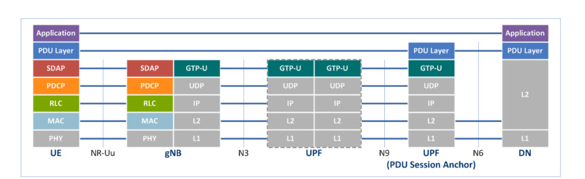
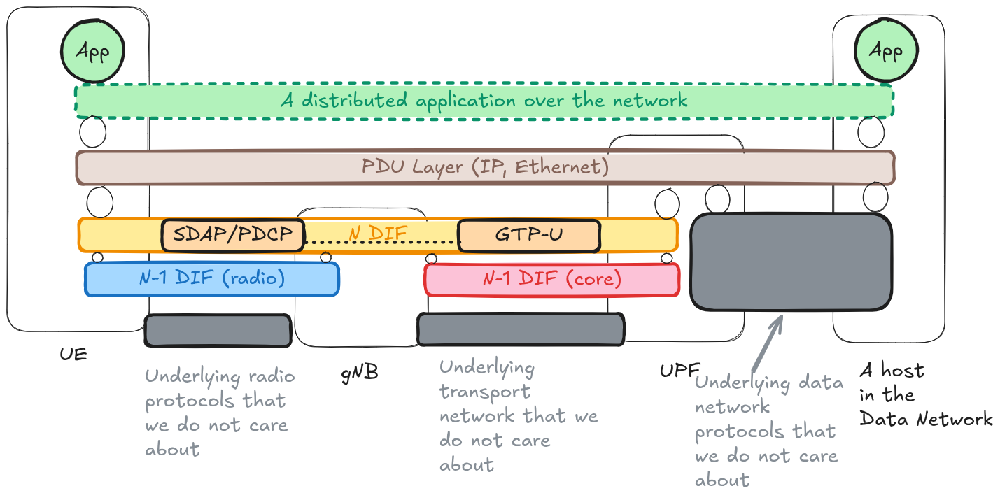

This post clarifies what a "network slice" means in 3GPP terms, but from a user-plane (UPF) perspective. The punchline is that slicing mostly shows up as *policy and resource partitioning* around otherwise familiar user-plane mechanisms.

## A quick reminder: 5G user-plane layering

In 3GPP-style diagrams, you can think about the user plane as a set of layered transports/mappings:

If we look at the same idea through the IPC model lens, it maps cleanly to a recursive stack:

Concretely, the mental model used later in this post is:

- At the "service" level (what we call the N-DIF layer in IPC terms), the UE has one or more PDU sessions / PDU flows.
- These are mapped onto lower-layer transport constructs. In 3GPP jargon you will see **QoS flows** (core side) and **data radio bearers (DRBs)** (radio side).

The details vary by deployment, but the important point is that there are multiple layers where *policy* can decide how traffic is treated, without necessarily changing forwarding.

## Network Slice Definition

With that reminder, the 3GPP definitions of "network slice" are intentionally broad:

- A set of network functions and corresponding resources necessary to provide the required telecommunication services and network capabilities [1].
- A logical network that provides specific network capabilities and network characteristics [2].

If you want an operational definition that is useful at the UPF level:

In 5G, a **network slice instance (NSI)** is a set of network + compute resources reserved/managed to deliver a given service. This is primarily an *administrative and orchestration* construct. On the wire, it shows up as identifiers and policies that steer how resources are allocated and how traffic is admitted.

Practically: two PDU sessions for the same UE may be associated with different slices if they are tied to different S-NSSAI / NSI selection outcomes, even if the packets ultimately traverse the same physical infrastructure.

In IPC-model terms, you can think of slicing as multiple N-flows that carry (or are associated with) a slice context used by policy: admission control, QoS enforcement, resource caps, accounting, etc. The key idea is that slicing is mostly a **policy/management overlay** applied to existing user-plane mechanisms.

Let's make this concrete.

Imagine a mobile virtual network operator (**MVNO**) using the infrastructure of a public land mobile network operator (**PLMNO**). The PLMNO "rents" part of the network to the MVNO; one way to implement that is to give the MVNO access to (one or more) slice instances with defined limits and service profiles.

In 6G-RUPA terms: when a UE (belonging to the MVNO) requests a new N-flow (analogous to establishing a PDU session in 5G), it includes the slice context (e.g., an NSI identifier) as part of the flow allocation request.

The PLMNO's flow allocator can then enforce slice policies such as:

- Is this slice valid for this MVNO / subscriber?
- Does the requested QoS profile fit the service agreement for this slice?
- Has this slice exceeded configured caps (e.g., number of sessions, throughput, aggregate resource usage)?

If the checks pass, the allocator creates the flow and maps it onto the underlying (N-1) DIFs (radio and core).

Crucially, at the level of **forwarding state**, slicing often does not require new forwarding entries. If two flows have the same (topological) destination, they can still be aggregated under the same forwarding-table entry. The forwarding function (e.g., the RMT in RINA terms) does not need to understand MVNOs, NSI IDs, or "slices"; it only needs to forward.

In other words: slicing is largely about *who is allowed to create which flows* and *what resources those flows can consume*, not about changing the basic forwarding paradigm.

## References

1. 3GPP TS 22.261 V20.4.0 - Service requirements for the 5G system. Available at: <https://portal.3gpp.org/desktopmodules/Specifications/SpecificationDetails.aspx?specificationId=3107>

2. 3GPP TS 23.501 V19.5.0 - System architecture for the 5G System (5GS). Available at: <https://portal.3gpp.org/desktopmodules/Specifications/SpecificationDetails.aspx?specificationId=3144>
